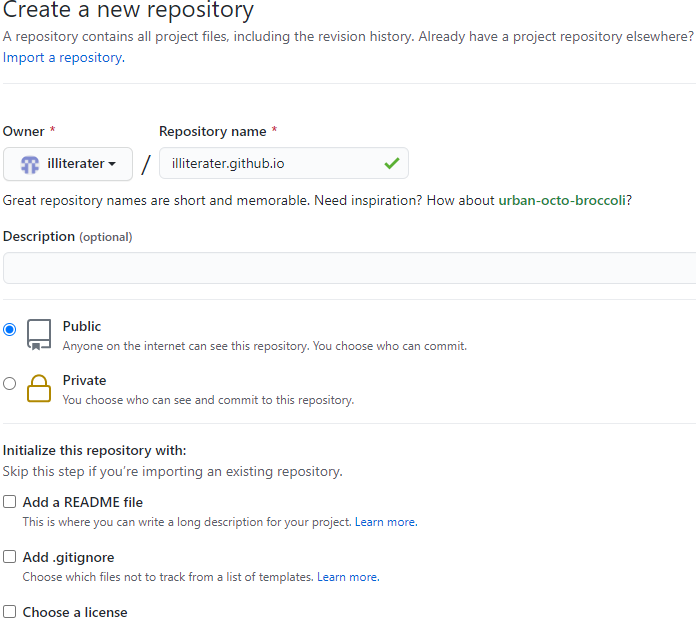
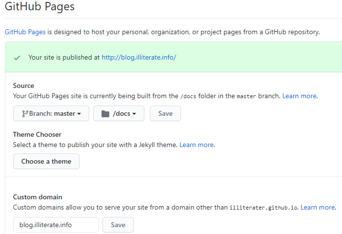
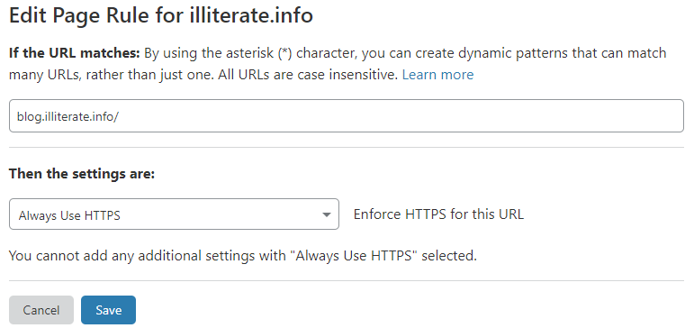

# hugo生成静态网页

## 安装hugo
1. 访问Github下载Hugo的应用程序，下载地址 https://github.com/gohugoio/hugo/releases
2. windows请选择下载hugo_0.xx.0_Windows-64bit.zip
3. 下载完成止之后解压文件至C:\Windows\system32，若其他路径需添加到系统环境变量Path中
4. 打开CMD，执行 hugo version 命令验证是否安装成功

```
C:\Users\XXXXXX>hugo version
Hugo Static Site Generator v0.80.0-792EF0F4 windows/amd64 BuildDate: 2020-12-31T13:37:57Z
```
## 本地hugo目录
1. 新建/指定本地目录，通过hugo把站点生成到该目录下 （CMD中）
   $ hugo new site E:/website/second-blog
2. 命令执行后查看E:/website/second-blog目录，查看文件目录结构。
```
│  config.toml
│
├─archetypes
│      default.md
│
├─content
├─data
├─layouts
├─static
└─themes
```
## 安装git
1. 从git官网 https://git-scm.com/downloads/ 下载
2. 安装git

## 安装hugo主题
1. 下载一个主题并加载到config.toml文件中 （CMD中）

 `git clone https://github.com/yihui/hugo-ivy.git`

2. 通过在 config.toml 配置使用：theme = "hugo-ivy"

另一种方法（未尝试）：
下载一个主题并加载到config.toml文件中：
```
git init
git submodule add https://github.com/budparr/gohugo-theme-ananke.git themes/ananke

# Edit your config.toml configuration file
# and add the Ananke theme.
echo 'theme = "ananke"' >> config.toml
```

## 生成新的文章 （CMD中）
`hugo new posts/first-post.md`
在content目录中会自动以archetypes/default.md为模板在content/posts目录下生成一篇名为first-post.md的文章草稿：
```
---
title: "First Post"
date: 2021-01-14T14:38:08+08:00
draft: true
---
```
在content/posts目录下打开并编辑，完成后去掉标记为草稿的这一行：draft: true

## 预览
在cmd中使用如下命令建立本地服务器：

>hugo server

在浏览器中输入网址`http://localhost:1313/`就可以在浏览器中查看网页效果了

## 发布
没有问题了便可以使用如下命令：
>hugo

如此一来网页便生成在默认的public子目录中了。

# 发布并托管到Github

1. 创建GitHub Pages site
在Github中添加一个空白repository，注意不要添加如README，.gitignore等文档。得到Github中该repository的网址：

`illiterate.github.io`



2. 使用/docs发布到master branch
在config.toml中添加如下一行配置，使得生成的网页默认保存在/docs子目录下：

`publishDir = docs`

运行hugo命令后生成的网页文件将保存在/docs子目录下。以便将所有文档push到Github的master branch

3. 在网站本地文档根目录中初始化git

```
git init
git add .
git commit -m "first commit"
git remote add origin https://github.com/illiterater/illiterater.github.io.git
git push -u origin master
```

注意`illiterater.github.io`后加上 **.git**

4. 设置GitHub Pages选项
进入Github对应repository的Settings标签菜单，在GitHub Pages选项的Source栏选择master branch /docs folder



5. 检查
访问 http://illiterater.github.io 看到用Hugo生成的网页了

# 配置个人域名
购买域名，设置域名解析
1. 推荐[namesilo.com](https://www.namesilo.com/)
2. 设置域名解析，两种方法
在[Manage DNS](https://www.namesilo.com/account_domain_manage_dns.php)中
- 绑定自己域名的根域名：增加两条"A"记录 192.30.252.153和192.30.252.154 （均为GitHub地址）


- 绑定自己域名的二级域名：增加一条"CNAME"记录


3. 在GitHub Pages选项中设置Custom domain，下面为绑定二级域名


完成后会在Github的[repository](https://github.com/illiterater/illiterater.github.io)下生成CNAME文件

4. 更新网站本地文档根目录

由于Github的repository中新生成了CNAME文件，和本地目录不一致，需要远程同步到本地。

在网站本地文档根目录中： `git pull origin master`

5. 更新文档并同步到网站，md文档更新后运行

```
# Build the project.
hugo # if using a theme, replace by `hugo -t <yourtheme>`

# Add changes to git.
git add .

# Commit changes. $msg is user defined message
git commit -m "$msg"

# Push source and build repos.
git push origin master
```
还可以新增脚本 (git_update.bat)放在网站本地文档根目录中:
```
#! /web

hugo
git add .
git commit -m "Publishing to Github"
git push origin master
```

# 配置CloudFlare以使用HTTPs
Github Pages不支持在自定义域名中使用HTTPs协议，浏览器会提示网页不受信任。[CloudFlare](https://www.cloudflare.com/)为我们提供了一套免费的解决方案！

1. 注册CloudFlare，输入自定义的域名
2. 选择免费套餐，按提示完成
3. 按提示去namesilo.com的域名管理页面中更新 NameServers
4. 回到CloudFlare，检查 SSL/TLS


5. 打开"Page Rules"页面，点击"Create Page Rule"



6. 打开"DNS"页面，检查"DNS management for *yoursite*"

## 参考文档

- [1] [利用Hugo和Github Pages免费创建并永久托管网站](https://imroc.io/posts/hugo/building-website-for-free-using-hugo-and-github-pages/)
- [2] [Hugo 博客中文指南（基础教程）](https://www.cnblogs.com/chenxuhua/p/hugo-blog-chinese-user-guide.html)
- [3] [Hugo入门详细教程](https://www.youendless.com/post/hugo_base/)
- [4] [使用hugo搭建个人blog](https://blog.voidmain.guru/posts/2019-07-01-blog-with-hugo/)
- [5] [yihui.org](https://yihui.org/cn/about/)
- [6] [Pro Git book](https://git-scm.com/book/zh/v2)
- [7] [Git如何把本地代码推送到远程仓库](https://blog.csdn.net/JackLiu16/article/details/79751900?utm_medium=distribute.pc_relevant.none-task-blog-BlogCommendFromMachineLearnPai2-2.control&depth_1-utm_source=distribute.pc_relevant.none-task-blog-BlogCommendFromMachineLearnPai2-2.control)
- [8] [有哪些国外便宜域名注册商是值得推荐的？](https://zhuanlan.zhihu.com/p/63866401)
- [9] [Markdown基本语法](https://www.jianshu.com/p/191d1e21f7ed/)
- [10] [开源在线 Markdown 编辑器](https://pandao.github.io/editor.md/index.html)
- [11] [GitHub Hello World](https://guides.github.com/activities/hello-world/)
- [12] [Hugo 从入门到会用](https://olowolo.com/post/hugo-quick-start/)
- [13] [HUGO](https://kuang.netlify.app/blog/hugo.html)

Git和Github参考
- [14] [用git提交代码到github的完整步骤](https://www.jianshu.com/p/651cecec7c8f)
- [15] [在不同电脑上git push同个github账户下的repositories](https://yulijia.net/cn/%E8%BD%AF%E4%BB%B6%E4%B8%96%E7%95%8C/2013/02/06/use-one-github-account-on-two-computers.html)
- [16] [一个github账户多台电脑代码提交](https://www.cnblogs.com/Nick-M/p/5559042.html)
