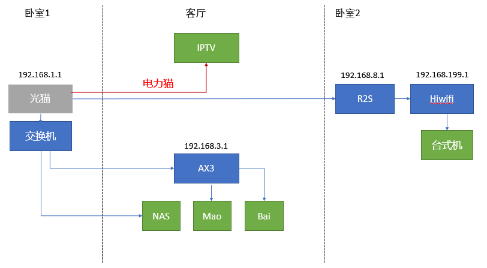
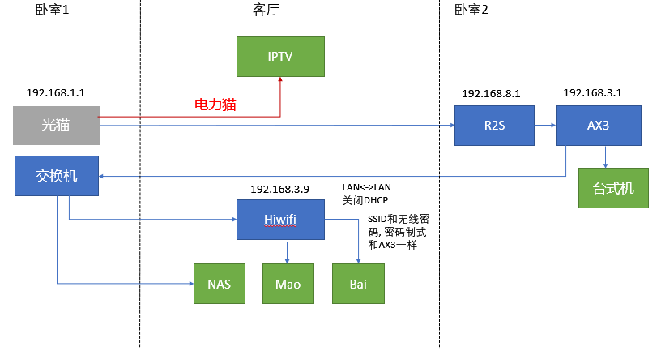
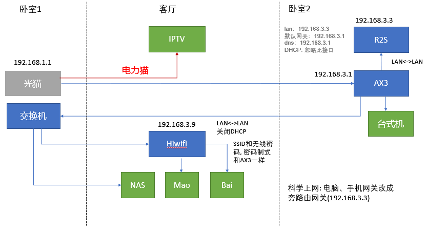
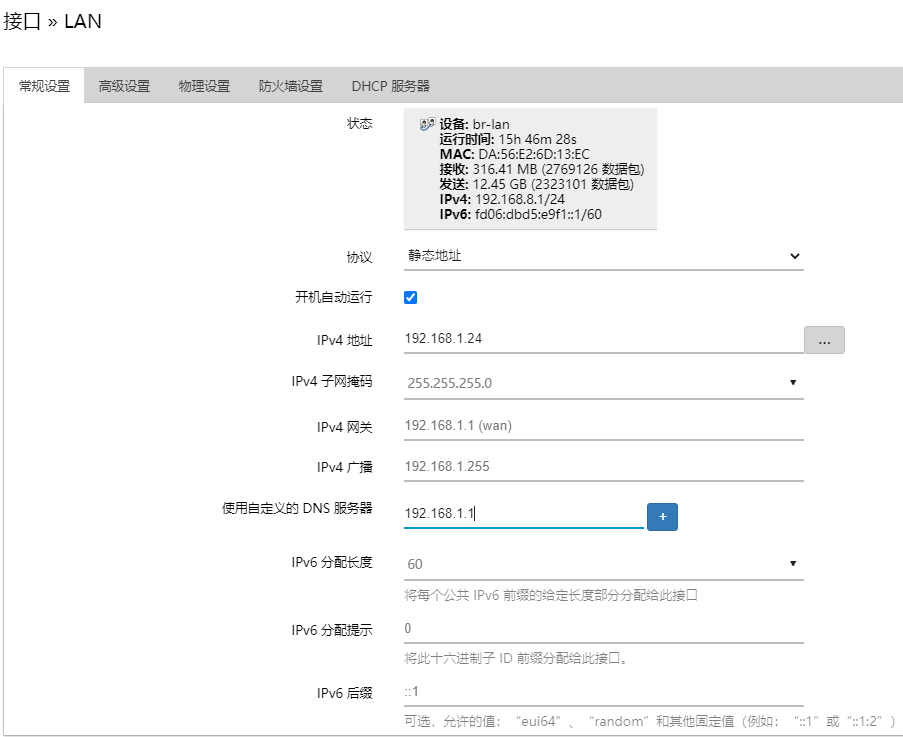
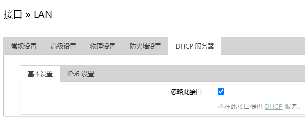

# 缘起
数月前入手(keng)了一台威联通的NAS，准备作为资料统一备份用。没时间也不想折腾，直接连上家里的网络就开始了备份。郁闷的是，网络的传输速度最快才能达到10M/s。就这样，忍受了很长一段时间，也备份了大概好几个TB的文件。

这次，由于疫情的原因，原定去三亚的度假计划就这么被无情的取消了。正好腾出时间优(zhe)化(teng)一下家里的网络了。

仔细梳理了一下，现在家里有3个网段，主要设备分布在家里的三个房间，见下图：



很明显，台式机访问NAS时要经过多次网络地址转换（Network Address Translation，NAT）。这应该时内网传输慢的根本原因。ps. 由于客厅只有一个网络接口，之前已经用电力猫将IPTV分离出来，给NAS一个独立网络接口。否则会更慢。

还有一些物理限制：
- 光猫在卧室1，直接连上路由的话，无线的信号会很差。加之弱电箱容量有限，无法将路由和光猫放一起。
- 各房间的有线网络从弱电箱中连出，其中只有卧室2有两个相邻有线接口。
- 客厅中的IPTV和NAS需放在一起，方便以后通过HDMI直接看NAS上的视频。
- 路由器和两台小一点的存储设备(Mao & Bai)，因为IPTV旁的地方有限，无法和NAS放在一起。只能放在客厅远离IPTV的有线网络接口附近。

现在想达到的要求是：
- 家里联网的设备都尽量连在同一个网段内。
- 物尽其用，无必要不购买新设备。
- 在原来的基础上，改动越少越好。

# 花开

在网上学习了一堆网络知识，终于厘清了头绪。重点是：
- 将光猫信号连接到卧室2的主路由(AX3)后，再连接回卧室2的交换机。
- AX3的性能强，将作为主路由。客厅的路由作为辅助路由。具体参考 [多台无线路由能不能同名无缝切换？](https://v2ex.com/t/195096?__cf_chl_jschl_tk__=f2bc290606679e70b9885c6a78c21e9b945fde92-1611555065-0-AesljIQjJ9J44A5osWjO78SC9b1JF1QzrcvWioCada5po39sj_pyNxRMc7UUP5sn127Tlu3pQEDIXkDWe1Ib2xwpwvTy87sgu_h34BJeXYyKCT4MM2gdzQpKfZ9qIgiVycNXCxEFl13S-SXQSFQevA1lqh3nh0s9TCHj-oJGtzB_pSruRQoJ8kCoMa0SX7EA6YiwymXpe-803Yn0Rwa3IOjVz9xyv10kEGAKjvRDiOlgRcRwmDGMivalAlKBK8PqpsYqaVADii_2sSSCbkJD9zv-bVURZopMqKd_wGo4s0D49lHIlbttJtuSI6iKjynWZB-NOOtox97j1i9_FTwCtU7Ve-pN7ADYhFuKI01Vz9jvdo_jiqSXdTxF1k3QBWIdeg)。重点如下：

```
1. 找性能最强的做主路由, 因为这一台路由会负责所有的DHCP. 预留几个IP给辅助路由器, 不要全部DHCP出去. 例如DHCP范围设成192.168.1.10~192.168.1.225. 预留192.168.1.2~9
2. 辅助的路由和主路由链好, 链接是LAN<->LAN (不是LAN<->WAN).
3. 辅助路由要关闭WAN, 关闭DHCP. 路由IP手动设成 192.168.1.X. 就是第一步预留段.
4. 辅助的路由SSID和无线密码, 密码制式全部都要一模一样. 不要一个WAP2 一个WPA的. 这样就应该可以了.
```

更详细的设置见[路由器有线桥接的两种方式异同](https://blog.csdn.net/silyvin/article/details/49667019)

修改后的网络图



担心：
1. 两个路由器之间的LAN<->LAN连接中间有一个交换机，是否会出现问题？**没问题**
2. 外部访问的流量全部通过R2S软路由，是否稳定？是否可以作为旁路由? **旁路由更佳**

理想的网络状态是大部分上网的流量不经过软路由，需要KX上网的设备才经过软路由，减少软路由的负荷。

于是，旁路由的方案应该是最佳方案。只需要修改KX上网的设备的网关（和DNS? **下面设置为主路由的IP**）即可！



# 花落

花了2天的时间分别尝试了上面两种网络部署，总结如下：
1. 极路由作为客厅辅助路由并不理想，连接到上面的设备IP地址仍然是 192.168.199.x，而且极路由的网口无法和设备进行有线连接。目前是用另一台交换机连接极路由和网络存储设备。计划再入一个华为AX3用Mesh组网，取代这里的交换机和极路由，彻底解决。
2. R2S旁路由设置：提醒：重启后 WAN和LAN口只有一个连在主路由上，可能需要分别插上网线后ping一下新的网关地址（此处：192.168.3.3）。






在Openwrt的网络-防火墙-自定义规则中增加一条：(不知道不加会有什么后果)

```
iptables -t nat -I POSTROUTING -j MASQUERADE
```

3. 旁路由的作用：在主路由的网段内，只要将网关改为旁路由的IP即可。DHCP仍由主路由负责。这样，关闭旁路由并不影响连在主路由的设备上网（DHCP自动分配网址）

> 旁路由严格来说应该被称作旁路网关，重要的其实就是这网关2字

4. 快速切换KX上网方式：
- 台式机和笔记本使用批处理（.bat）文件来进行快速切换

```
@echo off
set nic="Wi-Fi"
set /p choice="输入0切换为自动获取，输入1切换到科学上网，输入2切换到静态IP上网(国内)"
if "%choice%"=="0" goto C0
if "%choice%"=="1" goto C1 
if "%choice%"=="2" goto C2 
goto END
:C0
echo 开始设置自动获取IP
netsh interface ip set address "%nic%" dhcp
goto END
:C1
echo 切换到科学上网...
netsh interface ip set address "%nic%" static 192.168.3.50 255.255.255.0 192.168.3.3
netsh interface ip add dns name="%nic%" addr=192.168.3.1
echo 已经切换到科学上网
goto END
:C2
echo 切换到静态IP上网(国内)...
netsh interface ip set address "%nic%" static 192.168.3.50 255.255.255.0 192.168.3.1
netsh interface ip add dns name="%nic%" addr=192.168.3.1
echo 已经切换到静态IP上网(国内)
goto END
:END
pause
```

注意此处的 `set nic="Wi-Fi"`，应该和红圈处一致。


可以创建一个快捷方式到桌面上，并在快捷方式-属性-高级中勾选“作为管理员运行”。

- 其他无线设备的非KX上网通过AX3建立一个 Guest网络来访问

5. 效果检验：内网传输速度最快差不多有 100MB/s。这几天的劳动没白费！


## 参考文档
- [友善R2S 作旁路由-操作步骤](https://www.yuque.com/5zhimao/fwgq3b/gs26w1)
- [旁路由设置](https://www.lingbaoboy.com/2020/11/r2s.html)
- [Nanopi R2S软路由配置——旁路由](https://www.haoyufang.site:8892/%E7%BD%91%E7%BB%9C/Nanopi%20R2S%E8%BD%AF%E8%B7%AF%E7%94%B1%E9%85%8D%E7%BD%AE%E2%80%94%E2%80%94%E6%97%81%E8%B7%AF%E7%94%B1.html)
- [NAS、软路由、高清盒子、Web一个都不能少！](https://zhuanlan.zhihu.com/p/89373710)
- [旁路由设置的三种方式](https://oeone.cn/archives/486.html)

